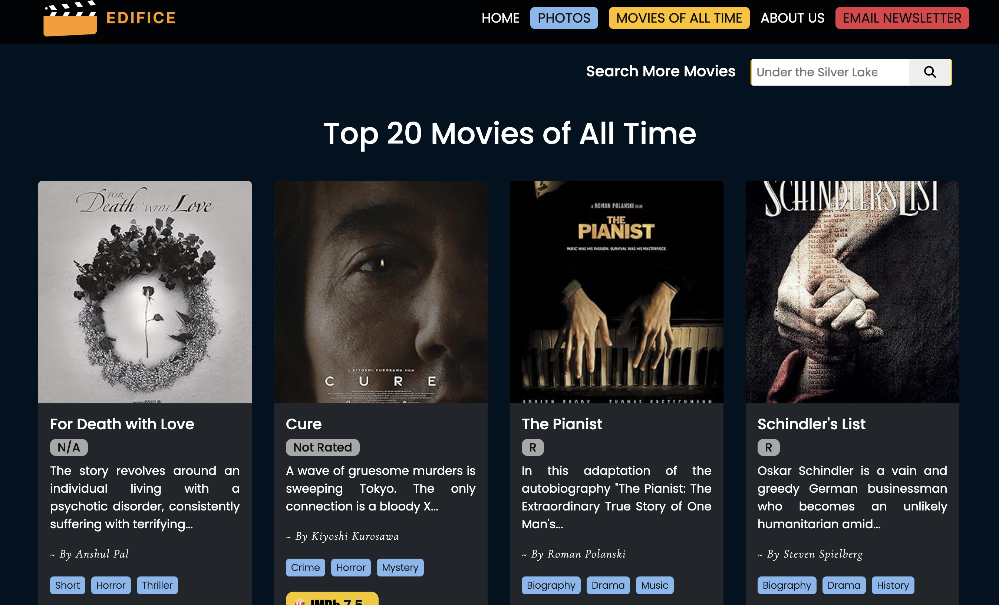

# EDIFICE - Cinema Of The World

**Live Website:** [Live On](https://web-programming-project-pbru.onrender.com)<br>
**LinkedIn:** [Profile](https://www.linkedin.com/in/varadpal/)<br><br>
_As the website is hosted through a public platform (Render.com) thus I request you to check Linkedin posts handy sceenshots_<br>
[Linkedin Post Link](https://www.linkedin.com/posts/varadpal_im-happy-to-share-this-edifice-a-movie-activity-7315974204770664450--lKx?utm_source=share&utm_medium=member_desktop&rcm=ACoAAD21ZMYByTchB2s73ja2yItGtPMhDR0nCQs)


---

## Overview

**EDIFICE** is a stylish and responsive movie web application where users can explore top-rated films, discover hidden gems, read cinematic blogs, and stay updated with the latest in film culture through our newsletter.  
Built with a passion for storytelling and visuals, this platform merges functionality with design for an immersive user experience.

---

## Features

-  **Top 20 Movies of All Time** – Handpicked classics and modern masterpieces.
-  **Search Any Movie** – Find films by title with real-time results.
-  **Our Top Picks** – Curated recommendations with visual sliders.
-  **Blog Posts** – Read insights on Oscar highlights, K-drama rise, and the rom-com decline.
-  **Newsletter Registration** – Stay updated with weekly cinematic stories via Mailchimp.
-  **Responsive UI** – Clean, modern, and mobile-friendly interface.

---

## Tech Stack

- **Frontend**: HTML, CSS, JavaScript
- **Backend**: Node.js, Express.js
- **Database**: MySQL
- **APIs**: IMDb npm API
- **Deployment**: Vercel
- **Newsletter**: Mailchimp API

---

## Preview

| Homepage | Top Picks Page | Email Newsletter |
|---------|------------------|-------|
|  |  |  |

---

## 📂 Setup Instructions

1. Clone the repository  
   ```bash
   git clone https://github.com/your-username/edifice.git
